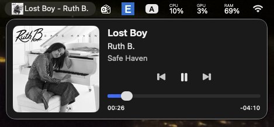

# BeatBar

BeatBar is a lightweight **macOS menu bar** “now playing” HUD for **macOS 15 (Sequoia) and newer**.

- **Menu bar strip**: album art, `Title - Artist`, and playback progress (similar spirit to Apple’s menu bar media control, with richer metadata).
- **Click the strip**: opens a larger **player panel** with artwork, metadata, transport, and volume (system output scalar when available).
- **Right-click the strip**: **Settings** (launch at login, menu bar title width / marquee) and **Quit**.

*Menu bar: album art, title — artist, progress. Popover: full artwork, metadata, transport, and scrubber.*

## Requirements

- **macOS 15+**
- **Xcode 16+** (or any Xcode that ships the **macOS 15 SDK**)
- **CMake 3.x** (only needed to compile the bundled MediaRemote adapter helper)
- System **Perl** at `/usr/bin/perl` (used by the upstream adapter pattern; no CPAN modules required)

## macOS 15.4+ note (important)

Apple tightened access to MediaRemote for normal app processes starting around **macOS 15.4**. BeatBar follows the community-supported approach from **[`mediaremote-adapter`](https://github.com/ungive/mediaremote-adapter)** (Perl + bundled helper framework) so **system-wide** “now playing” metadata, artwork, and remote commands keep working on current Sequoia builds.

This is **not** a Mac App Store–friendly integration (private framework surface area). Distribution is intended via **Developer ID** signing + **notarization**.

## Get the source

```bash
git clone <YOUR_REPO_URL> BeatBar
cd BeatBar
```

### Vendor `mediaremote-adapter`

This repository expects upstream sources at:

`Vendor/mediaremote-adapter/`

If that directory is missing, clone it:

```bash
mkdir -p Vendor
git clone https://github.com/ungive/mediaremote-adapter.git Vendor/mediaremote-adapter
```

(Optional) pin a release tag inside that repo for reproducible builds:

```bash
cd Vendor/mediaremote-adapter
git checkout v0.7.6
cd ../..
```

## Build the MediaRemote adapter (one-time per machine / after updates)

BeatBar bundles three artifacts into `BeatBar.app/Contents/Resources/Adapter/` at build time:

- `mediaremote-adapter.pl`
- `MediaRemoteAdapter.framework`
- `MediaRemoteAdapterTestClient`

Build them with CMake:

```bash
./scripts/build-adapter.sh
```

If you do not have CMake:

```bash
brew install cmake
```

## Build BeatBar from Xcode (recommended)

1. Open `BeatBar.xcodeproj`
2. Select scheme **BeatBar** and destination **My Mac**
3. **Product → Run** (`⌘R`)

The app is an **agent** (`LSUIElement`): there is **no Dock icon**. Look for BeatBar in the **menu bar**.

## Build BeatBar from the command line

```bash
xcodebuild \
  -project BeatBar.xcodeproj \
  -scheme BeatBar \
  -configuration Debug \
  -destination 'platform=macOS' \
  build
```

The built app is typically at:

`~/Library/Developer/Xcode/DerivedData/BeatBar-*/Build/Products/Debug/BeatBar.app`

### Build a Release app locally (command line)

Use this when you want a **Release** `.app` under `./build/BeatBar.app` (ad hoc signing). If `xcode-select -p` points only at **Command Line Tools**, set **`DEVELOPER_DIR`** to your **Xcode.app** (adjust paths if Xcode is installed elsewhere).

```bash
cd /path/to/BeatBar
./scripts/build-adapter.sh
DEVELOPER_DIR=/Applications/Xcode.app/Contents/Developer \
  /Applications/Xcode.app/Contents/Developer/usr/bin/xcodebuild \
  -project BeatBar.xcodeproj -scheme BeatBar -configuration Release \
  -destination 'platform=macOS' \
  -derivedDataPath ./build/DerivedData \
  build CODE_SIGN_IDENTITY=-
cp -R ./build/DerivedData/Build/Products/Release/BeatBar.app ./build/BeatBar.app
```

Run the copied app:

```bash
open ./build/BeatBar.app
```

## Release builds (high level)

1. Set your **Team** in Xcode (**Signing & Capabilities**).
2. **Product → Archive**
3. Distribute with **Developer ID**, then **notarize** and **staple** the app.

Apple’s documentation is the source of truth for signing/notarization steps:

- [Notarizing macOS software before distribution](https://developer.apple.com/documentation/security/notarizing_macos_software_before_distribution)

## Troubleshooting

### “MediaRemote adapter files are not bundled”

The Xcode **Run Script** phase copies adapter files into the app bundle. Ensure:

- `Vendor/mediaremote-adapter/bin/mediaremote-adapter.pl` exists
- `Vendor/mediaremote-adapter/build/MediaRemoteAdapter.framework` exists
- `Vendor/mediaremote-adapter/build/MediaRemoteAdapterTestClient` exists

Re-run `./scripts/build-adapter.sh`, then rebuild BeatBar.

### Adapter self-test fails

Re-run `./scripts/build-adapter.sh` on the same macOS version you run BeatBar on, then rebuild.

### Gatekeeper blocks unsigned local builds

Right-click the app → **Open** once, or sign with your Developer ID.

### Nothing shows in the menu bar

Confirm something is actively publishing **Now Playing** (Music, Spotify, many browser media sessions, etc.).

## Contributing / bug reports

Please include:

- macOS version (e.g. 15.5 (24F74))
- BeatBar version / git commit
- `mediaremote-adapter` git tag/commit you built

## Third-party licenses

See [`ACKNOWLEDGEMENTS.md`](ACKNOWLEDGEMENTS.md).

## Disclaimer

BeatBar depends on OS behavior and third-party adapter mechanics that may change in future macOS updates. There is no warranty; use at your own risk.
